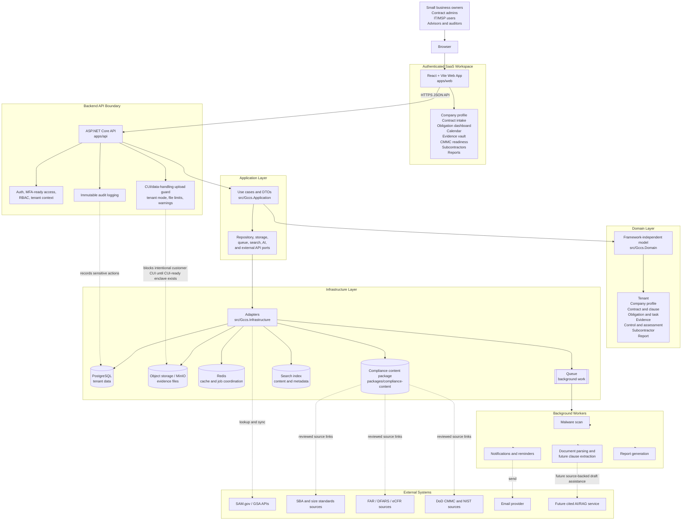

# Architecture

## MVP Posture

The first release is No-CUI / compliance management only. Real customer CUI must be blocked until a future approved `CuiReady` posture has architecture, customer terms, shared responsibility matrix, logging, access controls, support model, and assessment posture.

Tenant isolation, RBAC, audit logging, and CUI/data-handling implications are defined in `docs/security-control-implications.md`. Architecture changes must preserve those controls across API requests, repositories, background jobs, imports, exports, reports, search, and future AI/RAG workflows.

Known runtime, local infrastructure, test, source-content, and deferred integration dependencies are registered in `docs/dependency-register.md`. New dependencies that store, process, search, export, or transmit customer data require review before release.

## Application Boundaries

- `apps/web`: React + Vite UI for the authenticated SaaS workspace: profile, contracts, obligations, evidence, calendar, CMMC readiness, subcontractors, and reporting.
- `apps/api`: ASP.NET Core API exposing tenant-scoped compliance workflows.
- `src/Gccs.Domain`: Core model with no framework dependencies.
- `src/Gccs.Application`: Use cases, ports, and DTOs.
- `src/Gccs.Infrastructure`: database, object storage, queue, search, AI, and external API adapters.
- `packages/compliance-content`: source-backed obligation seed data reviewed by compliance experts before production use.

## Project Architecture Design Diagram

The MVP deployment keeps the product No-CUI / compliance management only. Evidence upload, document intake, AI-assisted extraction, and external integrations must preserve tenant isolation, source traceability, auditability, and data handling controls, and users must remain prevented from uploading CUI until a future approved `CuiReady` posture exists.

## Frontend Strategy

Use React + Vite for the authenticated application because the MVP is dashboard-heavy, workflow-oriented, and backed by the ASP.NET Core API. This keeps the app frontend lightweight, fast in local development, and cleanly separated from backend responsibilities.

If SEO or public content becomes a requirement, add a separate public site rather than migrating the SaaS workspace by default:

- `app.<domain>`: React + Vite authenticated SaaS app.
- `www.<domain>`: Optional Next.js marketing, pricing, documentation, and compliance content site.

Shared design tokens, brand assets, and API contracts should be factored so both surfaces feel consistent without coupling the authenticated app to an SEO framework.

## Planned Services

- PostgreSQL for transactional tenant data.
- Object storage for evidence files.
- Redis for cache and background job coordination.
- Queue worker for document extraction, notifications, malware scanning, and report generation.
- Search over curated compliance content and tenant documents.
- RAG service limited to cited internal and curated sources.

## Security Baseline

- MFA and SSO-ready auth.
- RBAC and tenant isolation.
- TLS everywhere.
- Encryption at rest.
- Immutable audit log.
- Malware scanning for uploads.
- Least-privilege administrative access.
- Backup, retention, export, and deletion workflows.
