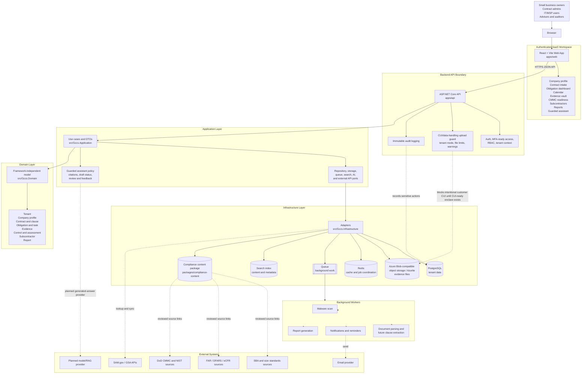

# Architecture

## MVP Posture

The first release is No-CUI / compliance management only. Real customer CUI must be blocked until a future approved `CuiReady` posture has architecture, customer terms, shared responsibility matrix, logging, access controls, support model, and assessment posture.

Tenant isolation, RBAC, audit logging, and CUI/data-handling implications are defined in `docs/security-control-implications.md`. Architecture changes must preserve those controls across API requests, repositories, background jobs, imports, exports, reports, search, and future AI/RAG workflows.

Known runtime, local infrastructure, test, source-content, and deferred integration dependencies are registered in `docs/dependency-register.md`. New dependencies that store, process, search, export, or transmit customer data require review before release.

## Application Boundaries

- `apps/web`: React + Vite UI for the authenticated SaaS workspace: profile, contracts, obligations, evidence, calendar, CMMC readiness, subcontractors, and reporting.
- `apps/api`: ASP.NET Core API exposing tenant-scoped compliance workflows.
- `src/Gccs.Domain`: Core model with no framework dependencies.
- `src/Gccs.Application`: Use cases, ports, and DTOs.
- `src/Gccs.Infrastructure`: database, object storage, queue, search, AI, and external API adapters.
- `packages/compliance-content`: source-backed obligation seed data reviewed by compliance experts before production use.

### Transaction And Audit Boundary

Current state: **Implemented for authenticated relational API mutations; external effects use explicit workflow boundaries**.

- Unsafe authenticated API operations run inside a scoped relational transaction, so repository saves and required audit appends commit or roll back together before the API result is executed.
- Workflows that require their own serializable transaction or perform filesystem, scanner, object-storage, or external lookup work are explicitly excluded from the request transaction. Their application service or repository owns the short database transaction and, where applicable, compensation or durable cleanup.
- Invitation acceptance owns its application transaction because the endpoint maps concurrency conflicts to `409`; the invitation claim, user, membership, onboarding, subscription, and audit writes therefore roll back before the error result is returned.
- Rejected-attempt audit entries are retained after the failed business transaction is rolled back. This replay is not a substitute for a transactional outbox and does not guarantee survival of a process failure between rollback and replay.

## Subscription Boundary

Current state: **Implemented for provider-independent pilot lifecycle enforcement; partially implemented for commercial billing**.

- Tenant identity, tenant status, data-handling posture, organization relationship, subscription plan, and subscription lifecycle are separate concepts.
- New platform-onboarded pilots receive a `PilotEvaluation` subscription. Paid onboarding receives a commercial subscription record, but FeDril does not independently verify billing-provider state.
- The tenant-membership authorization middleware evaluates subscription access on every authenticated tenant-scoped API request. Active and converted subscriptions allow normal access, grace-period subscriptions allow safe HTTP reads, and expired or cancelled subscriptions deny access.
- Request-time evaluation is authoritative; access does not depend on a background expiration worker running successfully.
- Platform lifecycle transitions use optimistic concurrency and write the subscription mutation and append-only audit entry in the same database transaction.
- Partner organizations do not receive implicit access to contractor tenants. Cross-tenant partner access continues to require explicit tenant membership and server-authoritative permissions.
- Subscription changes never modify or elevate `TenantDataPosture`; pilot or commercial status does not authorize CUI processing.

## Project Architecture Design Diagram

```mermaid
flowchart TB
    owners["Small business owners<br/>Contract admins<br/>IT/MSP users<br/>Advisors and auditors"]
    browser["Browser"]

    subgraph client["Authenticated SaaS Workspace"]
        web["React + Vite Web App<br/>apps/web"]
        uiModules["Company profile<br/>Contract intake<br/>Obligation dashboard<br/>Calendar<br/>Evidence vault<br/>CMMC readiness<br/>Subcontractors<br/>Reports<br/>Guarded assistant"]
    end

    subgraph apiBoundary["Backend API Boundary"]
        api["ASP.NET Core API<br/>apps/api"]
        auth["Auth, MFA-ready access,<br/>RBAC, tenant context"]
        uploadGuard["CUI/data-handling upload guard<br/>tenant mode, file limits, warnings"]
        audit["Immutable audit logging"]
    end

    subgraph appLayer["Application Layer"]
        useCases["Use cases and DTOs<br/>src/Gccs.Application"]
        guardedAssistant["Guarded assistant policy<br/>citations, draft status,<br/>review and feedback"]
        ports["Repository, storage,<br/>queue, search, AI,<br/>and external API ports"]
    end

    subgraph domainLayer["Domain Layer"]
        domain["Framework-independent model<br/>src/Gccs.Domain"]
        complianceModel["Tenant<br/>Company profile<br/>Contract and clause<br/>Obligation and task<br/>Evidence<br/>Control and assessment<br/>Subcontractor<br/>Report"]
    end

    subgraph infraLayer["Infrastructure Layer"]
        adapters["Adapters<br/>src/Gccs.Infrastructure"]
        postgres[("PostgreSQL<br/>tenant data")]
        objectStorage[("Azure Blob-compatible object storage / Azurite<br/>evidence files")]
        redis[("Redis<br/>cache and job coordination")]
        queue[["Queue<br/>background work"]]
        search[("Search index<br/>content and metadata")]
        contentRepo[("Compliance content package<br/>packages/compliance-content")]
    end

    subgraph workers["Background Workers"]
        scan["Malware scan"]
        extraction["Document parsing and<br/>future clause extraction"]
        notifications["Notifications and reminders"]
        reports["Report generation"]
    end

    subgraph external["External Systems"]
        sam["SAM.gov / GSA APIs"]
        sba["SBA and size standards sources"]
        far["FAR / DFARS / eCFR sources"]
        cmmc["DoD CMMC and NIST sources"]
        email["Email provider"]
        futureAi["Planned model/RAG provider"]
    end

    owners --> browser --> web
    web --> uiModules
    web -->|"HTTPS JSON API"| api

    api --> auth
    api --> uploadGuard
    api --> audit
    api --> useCases
    useCases --> ports
    useCases --> guardedAssistant
    useCases --> domain
    domain --> complianceModel

    ports --> adapters
    adapters --> postgres
    adapters --> objectStorage
    adapters --> redis
    adapters --> queue
    adapters --> search
    adapters --> contentRepo

    queue --> workers
    workers --> scan
    workers --> extraction
    workers --> notifications
    workers --> reports

    adapters -. lookup and sync .-> sam
    contentRepo -. reviewed source links .-> sba
    contentRepo -. reviewed source links .-> far
    contentRepo -. reviewed source links .-> cmmc
    notifications -. send .-> email
    guardedAssistant -. planned generated-answer provider .-> futureAi

    uploadGuard -. blocks intentional customer CUI until CUI-ready enclave exists .-> objectStorage
    audit -. records sensitive actions .-> postgres
```

The MVP deployment keeps the product No-CUI / compliance management only. Evidence upload, document intake, AI-assisted extraction, and external integrations must preserve tenant isolation, source traceability, auditability, and data handling controls, and users must remain prevented from uploading CUI until a future approved `CuiReady` posture exists.

## Guarded Assistant Boundary

Current state: **Implemented** for the guarded user experience, PostgreSQL full-text-ranked database-backed approved-source retrieval, citations, draft/support/review labels, prohibited-request redirection, tenant-scoped answer/feedback/draft-action persistence, context-sensitive RBAC, atomic audit logging, and routing assistant answers into the operational expert-review queue. Searchable generated vectors and GIN indexes cover published obligations, accepted clause excerpts, approved SPR package metadata, and approved evidence metadata, so relevance filtering occurs before each bounded source-family result limit. Source-family access is derived from server permissions: published obligation-library records are generally available to an authorized assistant workflow, accepted clean contract-document excerpts require contract access, approved SPR preparation-package metadata requires report access, and approved unexpired evidence metadata requires evidence access. Tenant records are filtered in the database before content is materialized. `Cui`, `SyntheticCui`, `Unknown`, `Prohibited`, contained, dirty, expired, unapproved, and cross-tenant records are excluded. Generic completed reports are not treated as approved because they do not carry a governed approval lifecycle.

Assistant escalations create an idempotent open queue item linked to the answer, retain a `NeedsExpertReview` feedback record, expose answer citations to authorized reviewers, validate assignees as active tenant members, queue assignment notifications according to user preferences, and support audited governed dispositions. Resolution persists reviewer, timestamp, decision, and notes on the answer, but `accepted_as_reviewed_draft` remains reviewed draft guidance. Product-mediated promotion is **Implemented** through optional `aiOutputId` provenance on report, generated-policy, SSP narrative, POA&M, and SSP customer-package creation: declared AI use must reference approved, unexpired current-tenant output and the link commits atomically with the deliverable and audit events. A generated-answer model/RAG provider and semantic/vector retrieval are **Planned**. The implemented lexical search uses English stemming and a bounded two-term minimum-match query; it does not provide semantic similarity. Do not claim that the assistant provides legal advice, certification decisions, CUI/classified processing, or autonomous compliance decisions.

AI interaction logging and review are **Implemented** on the same durable `assistant_answers` aggregate used by the guarded assistant. Allowed prompts, server-generated prompt/model/retrieval metadata, citation snapshots, output, actor, tenant, workflow, classification, result, timestamps, and retention dates are stored together; prohibited or unsupported prompt bodies are replaced by a redacted placeholder before persistence. Review transitions append immutable `assistant_output_reviews` rows and atomically write audit events. Output listing and review-history reads are filtered by the viewer's workflow permission, `ManageObligations` controls decisions, and `ExportReports` controls complete tenant log export. Explicit links to reports, policies, SSPs, POA&Ms, or customer deliverables require current human-approved, unexpired output, an existing current-tenant target of the declared type, and the type-specific server permission (`ManageReports`, `ManageObligations`, or `ManageCmmc`). The hourly retention worker archives expired output in bounded retryable batches, uses PostgreSQL row claiming to prevent duplicate work across API instances, and appends review and audit history. Database migrations run before hosted services start, and the approved staging/production workflows additionally apply their generated idempotent migration script before API deployment. The link is the enforceable provenance gate for product-mediated use; copied text that a user does not declare cannot be detected and must not be described as automatically prevented.

Labor applicability is a tenant-scoped contract aggregate. The application service validates explicit SCA/DBA/FAR Part 22 fields and source-backed activation, the EF adapter validates contract/clause/evidence ownership and synchronizes a durable compliance task, and the request transaction commits each applicability mutation with its audit event. Wage determination bytes remain in the shared evidence pipeline rather than creating a second upload boundary.

## Labor Category And Employee Classification Boundary

Current state: **Implemented** for tenant-scoped labor categories, employee assignments, wage/fringe/effective-date data, source references, evidence links, sensitive-field redaction, classification review metadata, append-only reclassification history, and atomic mutation/audit persistence. **Do not claim** that these workflow records are legal wage or labor determinations.

- `ViewContracts` authorizes category and redacted assignment reads. `ManageContracts` authorizes category, assignment, reclassification, deactivation, and review mutations. `ViewSensitiveEmployeeData` separately authorizes employee options, names, and email addresses and is limited to Owner, Admin, and Compliance Manager roles.
- Assignment request contracts accept an employee identifier but not client-asserted names or email addresses. Infrastructure resolves the active current-tenant employee, contract, category, and evidence references.
- Categories require source references, nonnegative wage and fringe values, and valid effective dates. Assignment creation and reclassification reject missing sources, inactive or cross-contract categories, dates outside the category period, and overlapping active assignments.
- Tenant-qualified foreign keys prevent cross-tenant contract, employee, category, and evidence links. PostgreSQL additionally enforces nonnegative rate, effective-date, review-metadata, and active-assignment overlap constraints.
- Reclassification preserves prior and new category identifiers and titles, actor, timestamp, and reason. Assignment edits and reclassification reset reviewer metadata to `PendingReview`; review decisions store the authenticated reviewer and server timestamp.
- Labor category and assignment mutations share the standard request transaction with append-only audit writes. Audit metadata contains identifiers and workflow state, not employee names or email addresses.
- The UI exposes loading, empty, validation-error, read-only, sensitive-field-restricted, create, deactivate, reclassify, and review states while retaining the No-CUI warning.

## Frontend Strategy

Use React + Vite for the authenticated application because the MVP is dashboard-heavy, workflow-oriented, and backed by the ASP.NET Core API. This keeps the app frontend lightweight, fast in local development, and cleanly separated from backend responsibilities.

If SEO or public content becomes a requirement, add a separate public site rather than migrating the SaaS workspace by default:

- `app.<domain>`: React + Vite authenticated SaaS app.
- `www.<domain>`: Optional Next.js marketing, pricing, documentation, and compliance content site.

Shared design tokens, brand assets, and API contracts should be factored so both surfaces feel consistent without coupling the authenticated app to an SEO framework.

## SSP Builder Boundary

Current state: **Implemented** for structured sections, deterministic source-backed narrative drafts, classified generated-policy sources, approval-time source locking, and immutable SSP internal-review packages. **Planned** for an approved external AI provider; AI-assisted requests currently fail closed.

- SSP sections are durable relational aggregates with typed links to governed tenant or compliance records and append-only lifecycle history.
- The server validates tenant ownership and evidence eligibility before accepting links. Raw client identifiers never establish tenant scope.
- Draft and in-review sections may be edited. Approval requires the ordered review transition, owner, reviewer, review date, and source references, eligible governed-record links, or documented rationale.
- Section mutation, lifecycle history, and audit append use the authenticated relational transaction boundary.
- SSP narratives and their source snapshots are durable tenant-scoped aggregates. Generation requests carry source type and ID only; infrastructure resolves current-tenant ownership, governed approval state, freshness, classification, display metadata, and a revision fingerprint.
- Narrative approval re-resolves every source inside the database transaction and acquires shared locks on the authoritative PostgreSQL rows, blocking concurrent source mutation until approval completes. Missing, changed, expired, unapproved, prohibited, unknown, or cross-tenant references block approval. Approved text is immutable, and approving a replacement atomically supersedes the previous approved narrative.
- Generated policies require explicit classification for generation and editing. Approval revalidates classification and placeholder completion; derived evidence and SSP source fingerprints preserve the classification and classification revision. Pre-migration policies are classified `Unknown` and cannot become SSP sources until reviewed.
- Generated text remains visibly draft-only until an authenticated reviewer approves it. Manual edits require explicit classification confirmation and pass through the tenant data-handling policy. Narrative text is excluded from audit metadata.
- SSP package generation accepts record IDs rather than client-asserted record metadata. Infrastructure resolves the tenant display name, approved and unexpired current-tenant evidence, allowed No-CUI classifications, and current-tenant POA&M records. Any missing, ineligible, prohibited, unknown, CUI, blocked, expired, or cross-tenant selection rejects the export without persisting a package or export audit event.
- SSP packages are immutable relational snapshots with human-readable content, JSON metadata, section/narrative/source/reviewer snapshots, evidence and POA&M references, version uniqueness per tenant, and append-only lifecycle history. Package persistence and export audit append share the relational transaction.
- `ExportReports` authorizes package generation and history reads. External sharing is a separate lifecycle: `ManageTenant` records explicit package-specific approval, and the share endpoint fails closed until that approval exists. Approval and share transitions are audit logged.
- `ViewCmmc` authorizes reads and comparisons; `ManageCmmc` authorizes section and narrative mutations. These permissions include the Compliance Manager role and preserve read-only auditor behavior.
- Deterministic source-backed generation is not represented as AI-assisted. The provider port exists, but the default adapter rejects AI-assisted requests. Enabling a provider requires reviewed provider/model/prompt provenance, data-retention configuration, evaluation evidence, and the same source, classification, review, and audit controls.
- This feature organizes compliance-management records. It does not certify the tenant, authorize CUI processing, or produce an assessor or government determination.

## SAM.gov Subcontracting Plan Reporting Preparation Boundary

Current state: **Implemented** for tenant-scoped SAM.gov SPR preparation data collection, package-eligibility gating, immutable package snapshots, internal review lifecycle, audited HTML/JSON export, and append-only user-recorded external receipt history. **Do not claim** external SAM.gov submission, verification, or synchronization.

Rationale: eSRS was decommissioned on February 20, 2026, and its subcontracting reporting functions moved to SAM.gov. The canonical product vocabulary and API therefore follow SAM.gov SPR, while legacy identifiers remain compatibility-only. The enforced preparation fields are based on the GSA Functional Data Dictionary version 1.0 dated March 6, 2026. Sources: [SAM.gov eSRS transition](https://sam.gov/esrs), [GSA SPR Functional Data Dictionary](https://www.fsd.gov/gsafsd_sp/en/subcontract-plan-reporting-functional-data-dictionary?id=kb_article_view&sysparm_article=KB0093498).

- `ViewReports` authorizes report-row reads and template download; `ManageReports` authorizes create, edit, import, and review decisions.
- The server resolves tenant ownership for the contract, contract-linked subcontractor, matching source-backed SPR applicability period, reporting-role UEI, contract PIID, and every evidence reference. Missing or cross-tenant references return the standard not-found contract.
- Rows and evidence links are durable relational records. Tenant-qualified foreign keys prevent cross-tenant links, and a normalized database unique constraint coordinates duplicate prevention under concurrent writes.
- Create, edit, import, review, and rejection changes share the relational transaction with append-only audit writes. A failed audit append rolls back the business mutation.
- Edits clear prior reviewer metadata and return a row to `PendingReview`. Only rows with complete SPR identity and eligibility metadata that are `Reviewed` or explicitly `Accepted` are eligible for final package preparation.
- CSV import is capped at 2 MB and 1,000 rows, requires the exact versioned header, and applies the same reference, amount, period, duplicate, evidence, and audit rules as manual entry.
- New rows resolve a source-controlled, reviewed, published, and effective SPR schema profile on the server. The profile governs categories, periods, fiscal-year range, whole-dollar handling, and eligibility confirmation; its ID, version, source URL, and definition SHA-256 are persisted with each row.
- Legacy rows are never silently promoted. A tenant-scoped remediation projection identifies blocking fields, and a read-only suggestion endpoint resolves PIID and UEI from authoritative tenant records without persisting them. Saving enrichment uses the normal validated update workflow, resets review, and audits changed field names and readiness transitions.
- Package generation snapshots the eligible rows, spend summaries, evidence references, exceptions, and exact governed schema profile references into durable tenant-scoped JSON. Snapshot content and version are immutable; only explicit lifecycle metadata can change. Lifecycle writes include the expected current status in the relational update so stale concurrent decisions fail without overwriting a completed transition or appending a false audit event.
- `ManageReports` authorizes generation and lifecycle decisions, `ViewReports` authorizes package and receipt reads, and `ExportReports` authorizes HTML/JSON export at the API boundary. Application request contracts do not accept permission flags or tenant identifiers. Generation, lifecycle changes, exports, and manual receipt records append audit events in the same relational transaction as any associated business write.
- Manual submission receipts are append-only, may reference eligible current-tenant evidence, and require an approved package. Corrections supersede earlier receipts by reference rather than mutating them. They record user-asserted external activity and are not proof that FeDril submitted or verified anything in SAM.gov.
- An explicit submission-provider port exists, but the installed adapter is disabled and the capability endpoint reports unavailable. The submit route fails closed with `spr_submission_unavailable`; enabling it requires an authorized contractor-facing SAM.gov integration and a separately reviewed synchronization design.
- Canonical APIs use `/subcontracting-plan-report-data` and `/subcontracting-plan-reports`; legacy `/esrs` routes and persistence names remain compatibility identifiers.
- This workflow collects and exports internal preparation data only. FeDril does not submit, verify, or synchronize reports with SAM.gov, determine legal reporting obligations, or provide government approval.

## External Portal Access Boundary

Current state: **Implemented** for durable tenant-scoped invitations, four external roles, approved package and contract scopes, expiration and revocation checks, resend and extension controls, authenticated email/subject binding, configurable strong-authentication claim checks, download permission checks, last-access state, append-only access history, tenant-admin API/UI controls, production external package-review routes, and atomic invitation/access audit writes when PostgreSQL is configured.

- `ManageUsers` authorizes invitation creation, listing, resend, extension, revocation, and access-history review. These routes always use the authenticated tenant context and tenant-qualified repository queries.
- External callers use the customer authentication plane and bypass tenant membership only on the explicit read-only portal access route. Tenant identity comes from the durable invitation rather than a client tenant header; normal workspace routes still require active tenant membership and server-provided permissions.
- Successful access requires the verified token email to match the invitation, binds the first external subject identifier, rechecks expiration/revocation, package scope, optional contract scope, strong-authentication claims when configured, and download permission when requested.
- Invitations reference only current-tenant, externally eligible package snapshots and current-tenant contracts. Completed unblocked Unclassified/FCI reports, externally approved/shared SSP packages, and approved subcontracting-plan report packages are eligible; CUI, unknown, blocked, draft, cross-tenant, or missing package scopes are rejected.
- Successful and denied access decisions append tenant-scoped history and sanitized audit metadata. Audit events contain identifiers, result codes, and counts rather than package contents or invitation email addresses.
- A resend request increments durable delivery-hook metadata without changing scope or expiration and cannot revive expired or revoked access. Provider delivery for external invitations is not yet connected and must not be claimed. Extension requires a new future expiration and cannot revive a revoked invitation. Revocation requires a reason and immediately fails request-time access checks.
- This access model does not authorize CUI sharing and does not grant any tenant workspace permission to a portal role.
- The external review UI is a dedicated customer-plane route at `/portal/review/{invitationId}` and does not render tenant workspace controls. Tenant identity is resolved from the invitation; the external API does not accept `X-Gccs-Dev-Tenant` or a request tenant identifier as authority.

## External Portal Package Lifecycle Boundary

Current state: **Implemented** for durable shared-package lifecycle records, tenant-admin lifecycle APIs and UI, request-time expiration/revocation checks, automatic expiration processing, scheduled reminder activity, reissue/supersede lineage, tenant-scoped activity reporting, the Story 34.2 external reviewer dashboard, durable append-only reviewer comments/questions, controlled text/HTML artifact downloads, and atomic review/activity/audit writes when PostgreSQL is configured.

- `ManageUsers` authorizes create, list, expire, revoke, supersede, reissue, and archive operations because that permission is limited to tenant Owner/Admin roles. `ViewAuditLog` authorizes the portal activity report.
- Every tenant administration lookup includes the authenticated tenant id. Missing and cross-tenant package ids return the standard tenant-safe `404` response.
- Portal request-time access requires a matching shared-package id, invitation id, source package id, `Active` state, and a future expiration timestamp. The review, comment, and download application paths recheck lifecycle access; a worker is not trusted to enforce cutoff.
- Share and reissue validation resolves the invitation and source package server-side. Revoked/expired/out-of-scope invitations and draft, internal-note, CUI, synthetic-CUI, prohibited, or unknown packages are rejected.
- Reissue creates a new active lifecycle record and preserves the predecessor. Active predecessors become superseded; revoked or expired predecessors retain their terminal state and revocation evidence while linking to the replacement.
- Automatic maintenance records one expiration-reminder activity and changes due active shares to `Expired`. Automatic expiration and its audit event share the relational transaction.
- Portal access, comment, download, reminder, expiration, supersede, revocation, reissue, and archive activity is append-only and tenant scoped. Lifecycle audit metadata contains identifiers and state only; it does not include package contents.
- Story 34.2 resolves source packages through a tenant-qualified adapter for completed unblocked generic reports, externally approved/shared SSP packages, and approved SPR packages. Draft, archived, contained, prohibited, CUI, synthetic-CUI, unknown, internal-review-note, missing, and cross-tenant records are excluded. Referenced evidence is rechecked for current tenant ownership, approval, expiration, containment, and Unclassified/FCI classification before display or download; the portal exposes bounded safe reference metadata rather than file bytes.
- Generic report records have a `Complete` state rather than an independent `Approved` lifecycle. A `ManageUsers`-authorized share is the explicit external-review approval and immutably records approver, timestamp, reason, review deadline, source version, and source fingerprint. Request-time review fails closed if the approved fingerprint is absent or the current source no longer matches. Legacy shares are preserved and backfilled from lifecycle creation metadata, but remain hidden until an authorized re-share captures a source fingerprint.
- Contract obligation matrices and sanitized audit histories can be prepared as immutable tenant-scoped `Report` snapshots through a `ManageReports` route with an additional source permission (`ViewObligations` or `ViewAuditLog`). Prepared packages remain internal until added to an invitation and explicitly shared. Audit-history packages omit raw audit metadata and are bounded at 10,000 rows.
- Controlled downloads currently support server-held HTML/text artifacts. The server adds package/version/download metadata and applies the configured watermark envelope. Binary PDF watermarking and direct evidence-file download are **Planned** and unsupported formats fail closed.
- This feature does not authorize sharing CUI and does not expose raw reviewer notes, tenant workspace mutations, evidence file bytes, or unrestricted audit-log exports.

## Planned Services

- PostgreSQL for transactional tenant data.
- Object storage for evidence files.
- Redis for cache and background job coordination.
- Queue worker for document extraction, notifications, malware scanning, and report generation.

## Assignment Notifications

Current state: **Implemented** for direct tenant-member obligation and task assignments.

- A direct assignment writes a tenant-scoped in-app notification independently of email availability.
- When assignment email is requested and the recipient's assignment-email preference is enabled, a separate outbox record is queued.
- `AssignmentEmailDeliveryWorker` claims outbox records with a lease, sends through Azure Communication Services, retries transient failures with bounded exponential delay, and audit-logs sent or failed delivery outcomes.
- Email contains a generic assignment notice and an authenticated deep link only. Customer-controlled task titles, evidence files, document contents, and customer-provided CUI are not copied into email.
- A role assignment appears under the signed-in member's `Role assignments` queue. Active same-tenant members holding the canonical role receive one deduplicated in-app notification with an authenticated link to the obligation queue.
- Role assignment does not queue email. Role email requires a future subscription, digest, or role-lead policy to prevent ungoverned fan-out.
- Local development context selection can switch tenant, actual tenant-member persona, and role so recipient-specific notification behavior is testable without changing production authentication.

Deployment dependency: actual email transmission occurs only when `InvitationDelivery` email-provider configuration is enabled and valid. With delivery disabled, the in-app notification remains available and assignment itself remains successful.
- Search over curated compliance content and tenant documents.
- RAG service limited to cited internal and curated sources.

## Security Baseline

- MFA and SSO-ready auth.
- RBAC and tenant isolation.
- TLS everywhere.
- Encryption at rest.
- Immutable audit log.
- Malware scanning for uploads.
- Least-privilege administrative access.
- Backup, retention, export, and deletion workflows.
