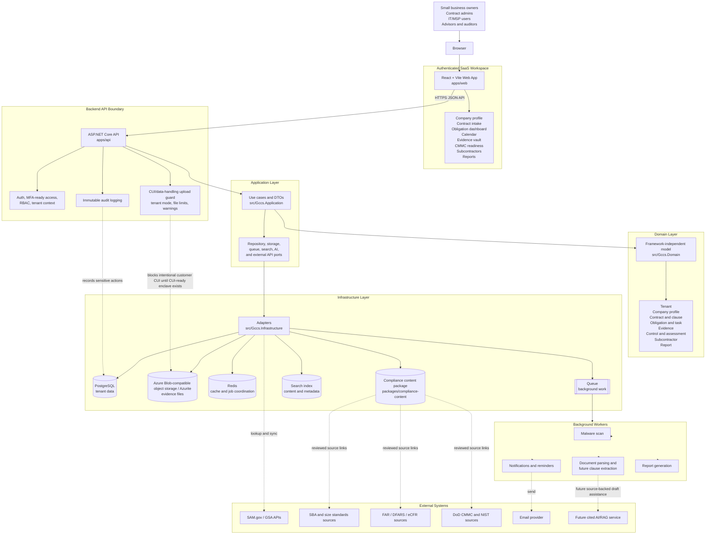

# Architecture

## MVP Posture

The first release is No-CUI / compliance management only. Real customer CUI must be blocked until a future approved `CuiReady` posture has architecture, customer terms, shared responsibility matrix, logging, access controls, support model, and assessment posture.

Tenant isolation, RBAC, audit logging, and CUI/data-handling implications are defined in `docs/security-control-implications.md`. Architecture changes must preserve those controls across API requests, repositories, background jobs, imports, exports, reports, search, and future AI/RAG workflows.

Known runtime, local infrastructure, test, source-content, and deferred integration dependencies are registered in `docs/dependency-register.md`. New dependencies that store, process, search, export, or transmit customer data require review before release.

## Application Boundaries

- `apps/web`: React + Vite UI for the authenticated SaaS workspace: profile, contracts, obligations, evidence, calendar, CMMC readiness, subcontractors, and reporting.
- `apps/api`: ASP.NET Core API exposing tenant-scoped compliance workflows.
- `src/Gccs.Domain`: Core model with no framework dependencies.
- `src/Gccs.Application`: Use cases, ports, and DTOs.
- `src/Gccs.Infrastructure`: database, object storage, queue, search, AI, and external API adapters.
- `packages/compliance-content`: source-backed obligation seed data reviewed by compliance experts before production use.

### Transaction And Audit Boundary

Current state: **Implemented for authenticated relational API mutations; external effects use explicit workflow boundaries**.

- Unsafe authenticated API operations run inside a scoped relational transaction, so repository saves and required audit appends commit or roll back together before the API result is executed.
- Workflows that require their own serializable transaction or perform filesystem, scanner, object-storage, or external lookup work are explicitly excluded from the request transaction. Their application service or repository owns the short database transaction and, where applicable, compensation or durable cleanup.
- Invitation acceptance owns its application transaction because the endpoint maps concurrency conflicts to `409`; the invitation claim, user, membership, onboarding, subscription, and audit writes therefore roll back before the error result is returned.
- Rejected-attempt audit entries are retained after the failed business transaction is rolled back. This replay is not a substitute for a transactional outbox and does not guarantee survival of a process failure between rollback and replay.

## Subscription Boundary

Current state: **Implemented for provider-independent pilot lifecycle enforcement; partially implemented for commercial billing**.

- Tenant identity, tenant status, data-handling posture, organization relationship, subscription plan, and subscription lifecycle are separate concepts.
- New platform-onboarded pilots receive a `PilotEvaluation` subscription. Paid onboarding receives a commercial subscription record, but FeDril does not independently verify billing-provider state.
- The tenant-membership authorization middleware evaluates subscription access on every authenticated tenant-scoped API request. Active and converted subscriptions allow normal access, grace-period subscriptions allow safe HTTP reads, and expired or cancelled subscriptions deny access.
- Request-time evaluation is authoritative; access does not depend on a background expiration worker running successfully.
- Platform lifecycle transitions use optimistic concurrency and write the subscription mutation and append-only audit entry in the same database transaction.
- Partner organizations do not receive implicit access to contractor tenants. Cross-tenant partner access continues to require explicit tenant membership and server-authoritative permissions.
- Subscription changes never modify or elevate `TenantDataPosture`; pilot or commercial status does not authorize CUI processing.

## Project Architecture Design Diagram

```mermaid
flowchart TB
    owners["Small business owners<br/>Contract admins<br/>IT/MSP users<br/>Advisors and auditors"]
    browser["Browser"]

    subgraph client["Authenticated SaaS Workspace"]
        web["React + Vite Web App<br/>apps/web"]
        uiModules["Company profile<br/>Contract intake<br/>Obligation dashboard<br/>Calendar<br/>Evidence vault<br/>CMMC readiness<br/>Subcontractors<br/>Reports"]
    end

    subgraph apiBoundary["Backend API Boundary"]
        api["ASP.NET Core API<br/>apps/api"]
        auth["Auth, MFA-ready access,<br/>RBAC, tenant context"]
        uploadGuard["CUI/data-handling upload guard<br/>tenant mode, file limits, warnings"]
        audit["Immutable audit logging"]
    end

    subgraph appLayer["Application Layer"]
        useCases["Use cases and DTOs<br/>src/Gccs.Application"]
        ports["Repository, storage,<br/>queue, search, AI,<br/>and external API ports"]
    end

    subgraph domainLayer["Domain Layer"]
        domain["Framework-independent model<br/>src/Gccs.Domain"]
        complianceModel["Tenant<br/>Company profile<br/>Contract and clause<br/>Obligation and task<br/>Evidence<br/>Control and assessment<br/>Subcontractor<br/>Report"]
    end

    subgraph infraLayer["Infrastructure Layer"]
        adapters["Adapters<br/>src/Gccs.Infrastructure"]
        postgres[("PostgreSQL<br/>tenant data")]
        objectStorage[("Azure Blob-compatible object storage / Azurite<br/>evidence files")]
        redis[("Redis<br/>cache and job coordination")]
        queue[["Queue<br/>background work"]]
        search[("Search index<br/>content and metadata")]
        contentRepo[("Compliance content package<br/>packages/compliance-content")]
    end

    subgraph workers["Background Workers"]
        scan["Malware scan"]
        extraction["Document parsing and<br/>future clause extraction"]
        notifications["Notifications and reminders"]
        reports["Report generation"]
    end

    subgraph external["External Systems"]
        sam["SAM.gov / GSA APIs"]
        sba["SBA and size standards sources"]
        far["FAR / DFARS / eCFR sources"]
        cmmc["DoD CMMC and NIST sources"]
        email["Email provider"]
        futureAi["Future cited AI/RAG service"]
    end

    owners --> browser --> web
    web --> uiModules
    web -->|"HTTPS JSON API"| api

    api --> auth
    api --> uploadGuard
    api --> audit
    api --> useCases
    useCases --> ports
    useCases --> domain
    domain --> complianceModel

    ports --> adapters
    adapters --> postgres
    adapters --> objectStorage
    adapters --> redis
    adapters --> queue
    adapters --> search
    adapters --> contentRepo

    queue --> workers
    workers --> scan
    workers --> extraction
    workers --> notifications
    workers --> reports

    adapters -. lookup and sync .-> sam
    contentRepo -. reviewed source links .-> sba
    contentRepo -. reviewed source links .-> far
    contentRepo -. reviewed source links .-> cmmc
    notifications -. send .-> email
    extraction -. future source-backed draft assistance .-> futureAi

    uploadGuard -. blocks intentional customer CUI until CUI-ready enclave exists .-> objectStorage
    audit -. records sensitive actions .-> postgres
```

The MVP deployment keeps the product No-CUI / compliance management only. Evidence upload, document intake, AI-assisted extraction, and external integrations must preserve tenant isolation, source traceability, auditability, and data handling controls, and users must remain prevented from uploading CUI until a future approved `CuiReady` posture exists.

## Frontend Strategy

Use React + Vite for the authenticated application because the MVP is dashboard-heavy, workflow-oriented, and backed by the ASP.NET Core API. This keeps the app frontend lightweight, fast in local development, and cleanly separated from backend responsibilities.

If SEO or public content becomes a requirement, add a separate public site rather than migrating the SaaS workspace by default:

- `app.<domain>`: React + Vite authenticated SaaS app.
- `www.<domain>`: Optional Next.js marketing, pricing, documentation, and compliance content site.

Shared design tokens, brand assets, and API contracts should be factored so both surfaces feel consistent without coupling the authenticated app to an SEO framework.

## SSP Builder Boundary

Current state: **Implemented** for structured sections, deterministic source-backed narrative drafts, classified generated-policy sources, approval-time source locking, and immutable SSP internal-review packages. **Planned** for an approved external AI provider; AI-assisted requests currently fail closed.

- SSP sections are durable relational aggregates with typed links to governed tenant or compliance records and append-only lifecycle history.
- The server validates tenant ownership and evidence eligibility before accepting links. Raw client identifiers never establish tenant scope.
- Draft and in-review sections may be edited. Approval requires the ordered review transition, owner, reviewer, review date, and source references, eligible governed-record links, or documented rationale.
- Section mutation, lifecycle history, and audit append use the authenticated relational transaction boundary.
- SSP narratives and their source snapshots are durable tenant-scoped aggregates. Generation requests carry source type and ID only; infrastructure resolves current-tenant ownership, governed approval state, freshness, classification, display metadata, and a revision fingerprint.
- Narrative approval re-resolves every source inside the database transaction and acquires shared locks on the authoritative PostgreSQL rows, blocking concurrent source mutation until approval completes. Missing, changed, expired, unapproved, prohibited, unknown, or cross-tenant references block approval. Approved text is immutable, and approving a replacement atomically supersedes the previous approved narrative.
- Generated policies require explicit classification for generation and editing. Approval revalidates classification and placeholder completion; derived evidence and SSP source fingerprints preserve the classification and classification revision. Pre-migration policies are classified `Unknown` and cannot become SSP sources until reviewed.
- Generated text remains visibly draft-only until an authenticated reviewer approves it. Manual edits require explicit classification confirmation and pass through the tenant data-handling policy. Narrative text is excluded from audit metadata.
- SSP package generation accepts record IDs rather than client-asserted record metadata. Infrastructure resolves the tenant display name, approved and unexpired current-tenant evidence, allowed No-CUI classifications, and current-tenant POA&M records. Any missing, ineligible, prohibited, unknown, CUI, blocked, expired, or cross-tenant selection rejects the export without persisting a package or export audit event.
- SSP packages are immutable relational snapshots with human-readable content, JSON metadata, section/narrative/source/reviewer snapshots, evidence and POA&M references, version uniqueness per tenant, and append-only lifecycle history. Package persistence and export audit append share the relational transaction.
- `ExportReports` authorizes package generation and history reads. External sharing is a separate lifecycle: `ManageTenant` records explicit package-specific approval, and the share endpoint fails closed until that approval exists. Approval and share transitions are audit logged.
- `ViewCmmc` authorizes reads and comparisons; `ManageCmmc` authorizes section and narrative mutations. These permissions include the Compliance Manager role and preserve read-only auditor behavior.
- Deterministic source-backed generation is not represented as AI-assisted. The provider port exists, but the default adapter rejects AI-assisted requests. Enabling a provider requires reviewed provider/model/prompt provenance, data-retention configuration, evaluation evidence, and the same source, classification, review, and audit controls.
- This feature organizes compliance-management records. It does not certify the tenant, authorize CUI processing, or produce an assessor or government determination.

## eSRS Preparation Data Boundary

Current state: **Implemented** for tenant-scoped subcontracting report data collection and internal package-eligibility gating. **Planned** for final eSRS package lifecycle and external eSRS submission or synchronization.

- `ViewReports` authorizes report-row reads and template download; `ManageReports` authorizes create, edit, import, and review decisions.
- The server resolves tenant ownership for the contract, contract-linked subcontractor, matching source-backed eSRS applicability period, and every evidence reference. Missing or cross-tenant references return the standard not-found contract.
- Rows and evidence links are durable relational records. Tenant-qualified foreign keys prevent cross-tenant links, and a normalized database unique constraint coordinates duplicate prevention under concurrent writes.
- Create, edit, import, review, and rejection changes share the relational transaction with append-only audit writes. A failed audit append rolls back the business mutation.
- Edits clear prior reviewer metadata and return a row to `PendingReview`. Only `Reviewed` or explicitly `Accepted` rows are eligible for final package preparation.
- CSV import is capped at 2 MB and 1,000 rows, requires the exact versioned header, and applies the same reference, amount, period, duplicate, evidence, and audit rules as manual entry.
- This workflow collects internal preparation data only. FeDril does not submit reports to eSRS, determine legal reporting obligations, or provide government approval.

## Planned Services

- PostgreSQL for transactional tenant data.
- Object storage for evidence files.
- Redis for cache and background job coordination.
- Queue worker for document extraction, notifications, malware scanning, and report generation.

## Assignment Notifications

Current state: **Implemented** for direct tenant-member obligation and task assignments.

- A direct assignment writes a tenant-scoped in-app notification independently of email availability.
- When assignment email is requested and the recipient's assignment-email preference is enabled, a separate outbox record is queued.
- `AssignmentEmailDeliveryWorker` claims outbox records with a lease, sends through Azure Communication Services, retries transient failures with bounded exponential delay, and audit-logs sent or failed delivery outcomes.
- Email contains a generic assignment notice and an authenticated deep link only. Customer-controlled task titles, evidence files, document contents, and customer-provided CUI are not copied into email.
- A role assignment appears under the signed-in member's `Role assignments` queue. Active same-tenant members holding the canonical role receive one deduplicated in-app notification with an authenticated link to the obligation queue.
- Role assignment does not queue email. Role email requires a future subscription, digest, or role-lead policy to prevent ungoverned fan-out.
- Local development context selection can switch tenant, actual tenant-member persona, and role so recipient-specific notification behavior is testable without changing production authentication.

Deployment dependency: actual email transmission occurs only when `InvitationDelivery` email-provider configuration is enabled and valid. With delivery disabled, the in-app notification remains available and assignment itself remains successful.
- Search over curated compliance content and tenant documents.
- RAG service limited to cited internal and curated sources.

## Security Baseline

- MFA and SSO-ready auth.
- RBAC and tenant isolation.
- TLS everywhere.
- Encryption at rest.
- Immutable audit log.
- Malware scanning for uploads.
- Least-privilege administrative access.
- Backup, retention, export, and deletion workflows.
