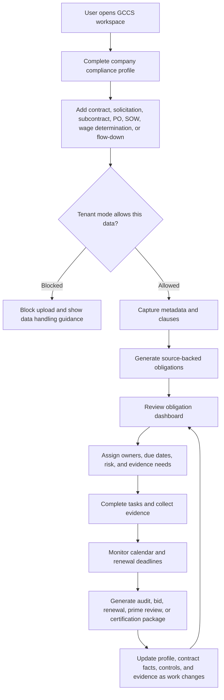
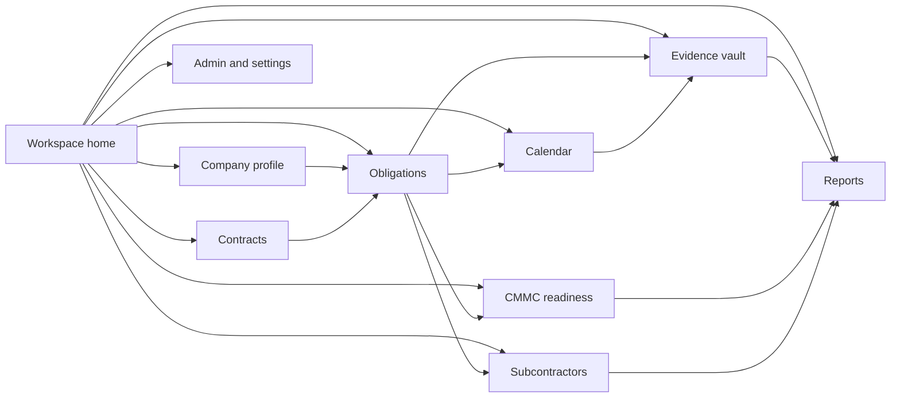
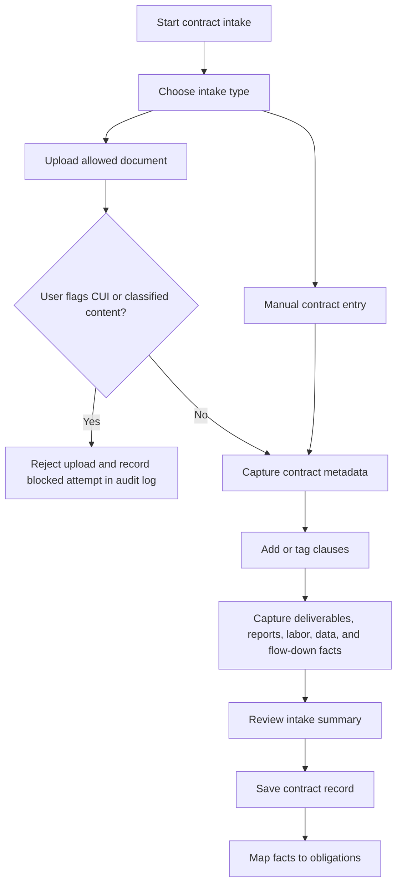
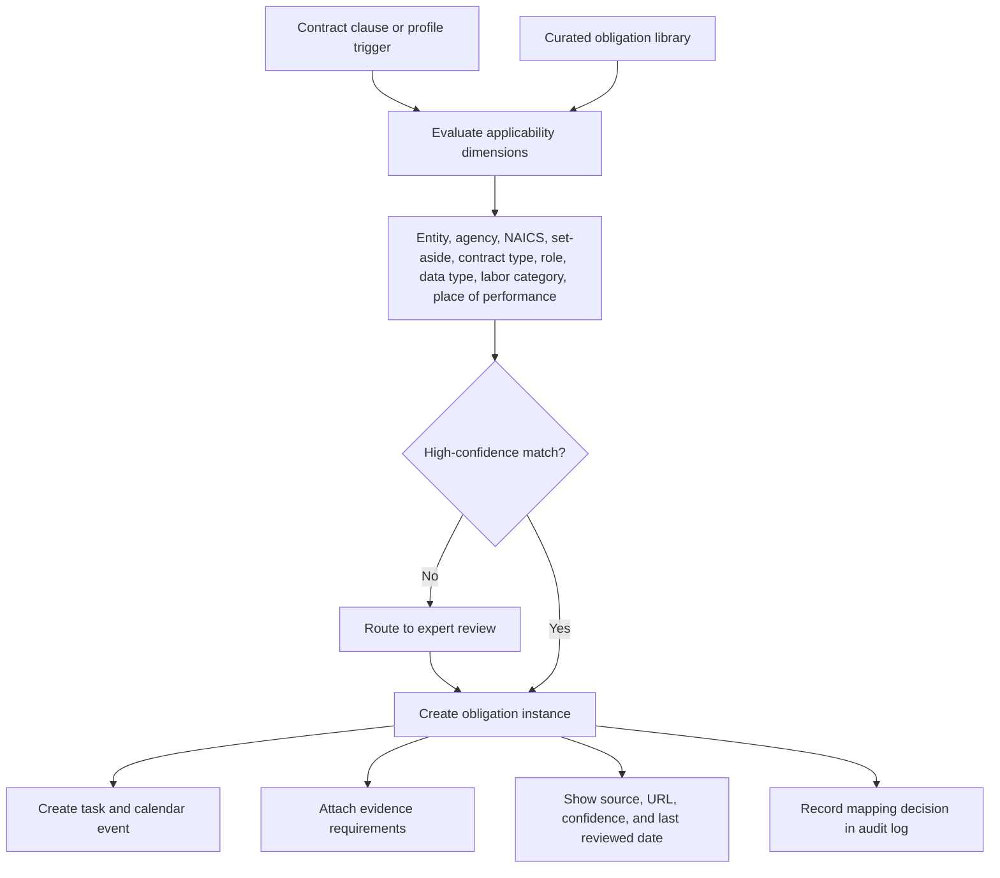
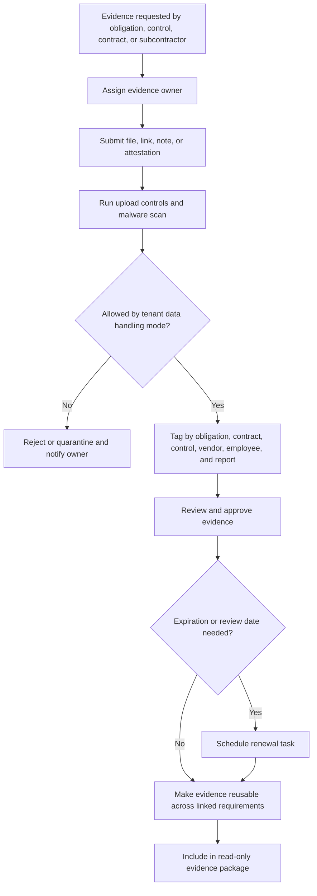
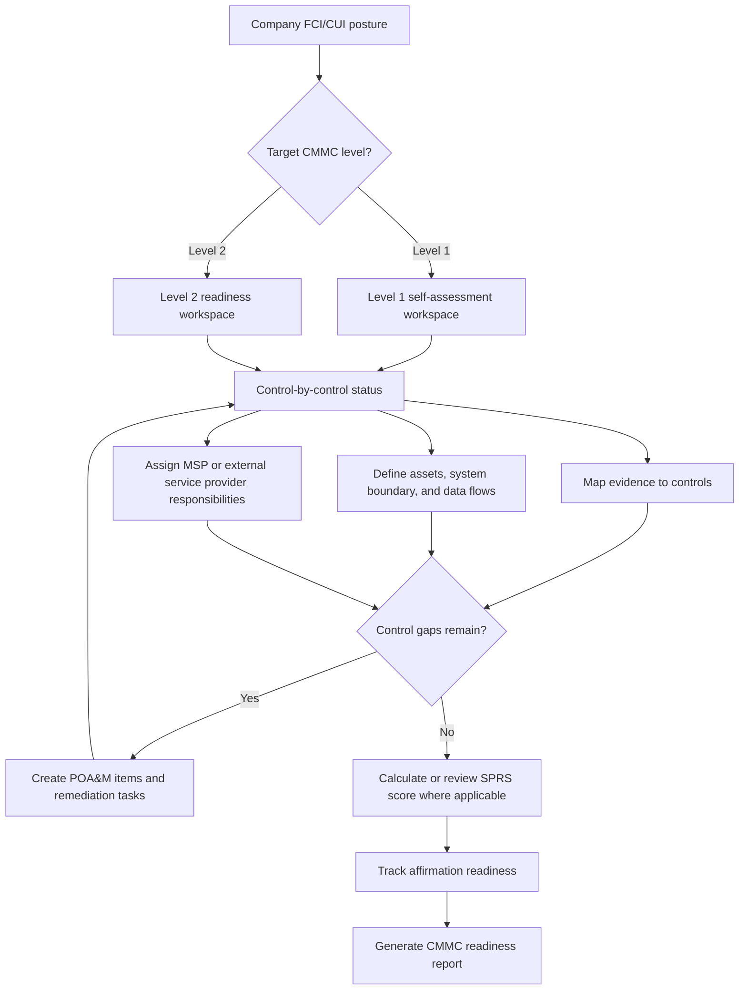
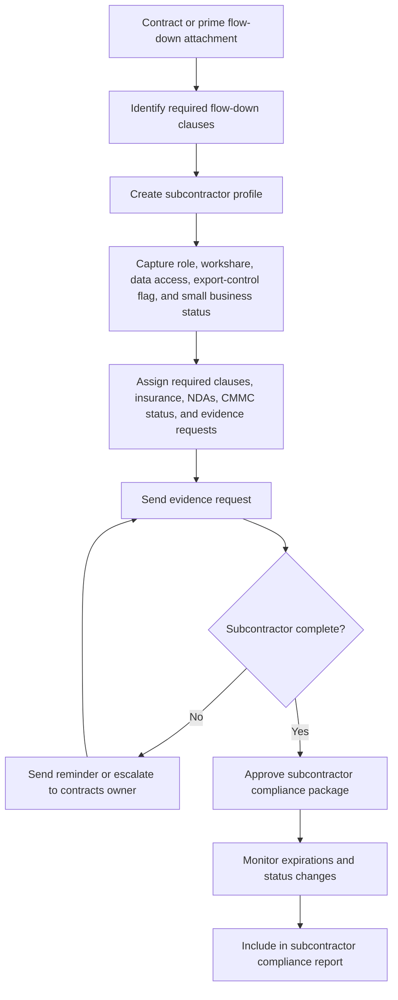
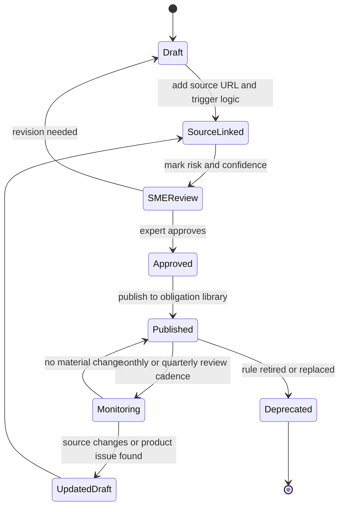

# Design Flow Diagrams

These diagrams translate the GCCS MVP product guidance into design flows for the authenticated SaaS workspace. The MVP is No-CUI / compliance management only with synthetic CUI-ready demonstration workflows: users can manage compliance work, metadata, obligations, tasks, and evidence, while real customer CUI is blocked unless the tenant is approved for future `CuiReady` operation.

## 1. User Operating Loop

## 2. Workspace Navigation Flow

## 3. Contract Intake Design Flow

## 4. Clause To Obligation Flow

## 5. Evidence Vault Lifecycle

## 6. CMMC Readiness Flow

## 7. Subcontractor Flow-Down Flow

## 8. Compliance Content Governance Flow

