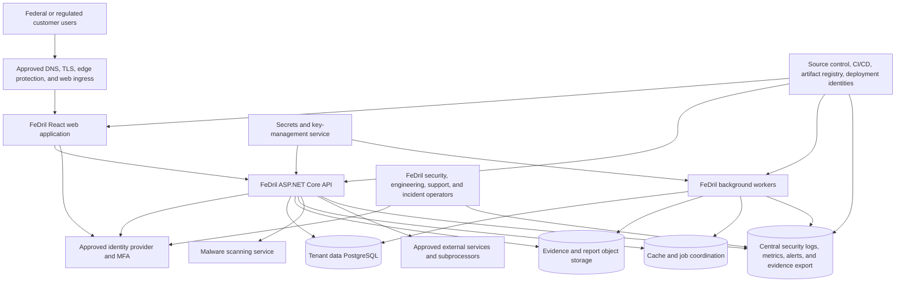

# Future FedRAMP Architecture Baseline

- Assessment date: 2026-09-03
- Repository commit reviewed: `f8924a4abf4fbf4f96eddd8b3334366575cb0192`
- Verification level: Read-only architecture and evidence assessment
- Current product posture: No-CUI / compliance management only

## Implementation Update — 2026-09-04

The three immediate deficiencies identified below have been addressed at the code-foundation level, with explicit operational limits:

- **Implemented:** package generation ignores the retained compatibility Boolean and always emits readiness-only, non-authorization language. No positive FedRAMP claim authority exists.
- **Implemented for control mappings and readiness packages:** tenant-scoped relational persistence, lifecycle history, optimistic concurrency, restart durability, and transactional audit writes replace production in-memory registration.
- **Partially implemented:** production Terraform now contains real Azure resource declarations, import blocks, CI validation, and a state-readiness-gated drift workflow. No import, plan against live state, apply, or production mutation was performed. Secure remote state, credential rotation, imports, and a reviewed zero-drift baseline remain required.

These changes do not establish FedRAMP certification, authorization, equivalency, assessment readiness, or permission to process CUI.

## Status And Scope

This directory documents reusable preparation for a possible future FedRAMP certification effort. It does not establish that FeDril is FedRAMP Certified, FedRAMP authorized, FedRAMP Moderate equivalent, government approved, or approved to process real customer CUI.

The current commercial No-CUI environment is evidence input only. It is not designated as the future assessed cloud service offering. The candidate regulated boundary remains `Planned` until the business activation gate, target certification profile, cloud architecture, information categories, and independent-assessment path are approved.

## Critical Findings

### P1 — Authorization-status language was client-influenced — mitigated

- Evidence: `CreateFedRampReadinessPackageRequest` accepts `GovernanceAuthorizedFedRampClaim` from the request in `src/Gccs.Application/Compliance/FedRampReadinessExportPackage.cs:75`.
- Current evidence: both readiness-package repositories ignore that Boolean and use a fixed statement that the package does not claim FedRAMP authorization. An API test verifies the fail-closed result when the client sends `true`.
- Evidence: the endpoint requires the tenant-level `ManageTenant` permission, not a separate platform security-governance authority, in `apps/api/Program.cs:5946-5963`.
- Residual limitation: the field remains in the wire contract for compatibility and is marked obsolete. A positive-claim governance model remains unimplemented; positive authorization language is prohibited until official evidence and platform authority exist.

### P1 — FedRAMP readiness evidence was volatile and concurrency-unsafe — partially remediated

- Current evidence: production dependency injection resolves EF Core repositories for mappings and readiness packages; the additive migration introduces tenant-scoped relational tables, composite tenant foreign keys, lifecycle history, and concurrency tokens. Tests cover restart persistence, tenant isolation, PostgreSQL stale-write rejection, and rollback when audit persistence fails.
- Residual limitation: in-memory implementations remain test adapters. Trust-artifact and SSP repositories were not part of this slice and remain unsuitable as durable assessment evidence.

### P1 — Deployment configuration lacked real infrastructure resources — partially remediated

- Current evidence: production Terraform declares discovered Azure resources and import addresses; CI runs Terraform formatting and validation; a weekly/manual workflow will fail on detected drift after the remote-state readiness gate is enabled.
- Residual limitation: no remote state, import, live plan, or apply was authorized. Existing commercial settings—including shared service-plan placement and current PostgreSQL exposure/availability settings—are represented for safe adoption, not endorsed as a FedRAMP baseline. A separate hardened regulated environment and policy-as-code remain planned.

### P2 — Vulnerability activity is not a complete persistent verification program

- Evidence: `.github/workflows/ci.yml:41-42` lists vulnerable .NET dependencies, `.github/workflows/ci.yml:118-119` runs `npm audit`, and `.github/workflows/ci.yml:242-243` runs Gitleaks.
- Gap: no repository evidence was found for an SBOM, container and infrastructure scanning, cloud-configuration drift detection, KEV handling, recurring non-machine control verification, persistent vulnerability reporting, or a complete information-resource inventory.
- Impact: CI checks are useful but cannot demonstrate the persistent verification and vulnerability-response coverage expected for the whole cloud service offering.

### P2 — Current evidence is fragmented and can be stale or environment-mismatched

- Evidence: `docs/production-readiness-production-deployment-evidence.md:5-9` says the September 2 launch candidate is awaiting deployment, while later rows preserve passing evidence from earlier candidates and environments.
- Evidence: `docs/production-readiness-backup-restore-evidence.md:136-140` limits restore evidence to a dated staging path and explicitly excludes production and regional disaster recovery.
- Impact: consumers can accidentally treat historical staging or superseded-candidate evidence as proof for the current release or future regulated environment.
- Required correction: use a normalized evidence index with environment, release, commit, collection time, expiry, reviewer, limitations, and supersession links.

## Current-State Classification

| Capability | Classification | Current evidence | Limitation |
| --- | --- | --- | --- |
| JWT authentication validation | Implemented for current non-development API configuration | `apps/api/Security/ApiSecurityExtensions.cs:68-125` validates issuer, audience, lifetime, and signing key. | MFA enforcement, privileged identity governance, and the future regulated identity tenant are not proven by this code. |
| Tenant-membership authorization and server-derived permissions | Implemented for the current API path | `apps/api/Security/ApiSecurityExtensions.cs:229-325` resolves active membership and replaces role/permission claims. | Endpoint inventory and behavior must be reverified for each future boundary and release. |
| API security headers and no-store behavior | Implemented | `apps/api/Security/ApiSecurityExtensions.cs:353-369`. | This is only one part of browser/API hardening; CSP and gateway controls are not established here. |
| Correlation IDs and API failure logging | Implemented | `apps/api/Security/ApiSecurityExtensions.cs:465-521`. | Central retention, tamper resistance, alert coverage, clock synchronization, and regulated-boundary routing remain unproven. |
| No-CUI deployment posture | Implemented as current deployment intent and application guardrail; operating effectiveness is evidence-limited | `.github/workflows/production.yml:27-35,60-84`; production and staging readiness documents. | Does not authorize CUI and depends on current environment configuration and user behavior. |
| Tenant-isolation and RBAC test evidence | Partially implemented | `docs/production-readiness-staging-security-evidence.md:26-41` and referenced tests/artifacts. | Much of the evidence is synthetic, staging-specific, and not tied to a future FedRAMP boundary. |
| Upload malware scanning and private storage | Partially implemented | `apps/api/appsettings.json:30-36`; `docs/production-readiness-production-smoke-evidence.md:31-38,112`. | Single-path smoke evidence does not prove recurring scanner availability, full storage hardening, or regulated-environment operation. |
| Backup and restore | Partially implemented | `docs/production-readiness-backup-restore-evidence.md`. | Evidence is staging point-in-time restore only; geo-DR, current production restore, retention sufficiency, and incident execution remain unproven. |
| Release provenance | Partially implemented | `.github/workflows/production.yml:47-59,86-140,214-240`. | Uses long-lived deployment credentials and does not attest all infrastructure or build inputs; current candidate execution is pending. |
| Vulnerability and secret scanning | Partially implemented | `.github/workflows/ci.yml:41-42,118-119,242-243`. | No complete persistent program, SBOM, cloud drift, container/IaC coverage, or response evidence. |
| FedRAMP control mapping and package workflows | Partially implemented | Application services, API endpoints, relational repositories, additive migration, and focused tests exist for mappings and readiness packages. | Trust and SSP artifacts remain in-memory; the current-rule mapping is incomplete; no independent assessment exists. |
| Candidate authorization boundary | Planned | This document provides an initial candidate model. | Requires approved use case, information categories, target profile, cloud design, and assessor review. |
| Real regulated infrastructure-as-code | Partially implemented foundation | Commercial production has resource declarations, import blocks, validation, and a gated drift workflow. | Live state adoption, zero-drift evidence, hardening, policy-as-code, and a separate regulated environment remain planned. |
| Security Decision Record and machine-readable certification package | Planned | Roadmap `FR-8`. | Existing SSP/readiness records do not satisfy the current 20x package rules. |
| FedRAMP certification, authorization, equivalency, or CUI approval | Do not claim | No official status evidence was identified. | Only official evidence for the exact assessed offering and boundary can change this classification. |

## Candidate Cloud Service Offering Boundary

The candidate is a separate, future FeDril regulated SaaS offering. It may reuse application source and control designs from commercial FeDril, but it must have separately governed infrastructure, configuration, evidence, releases, operations, and customer terms.

### Included Or Presumptively Included

| Resource | Responsibility | Reason |
| --- | --- | --- |
| Web application, API, workers, application configuration, and release artifacts | FeDril-managed | They directly handle or affect federal customer data and service security. |
| Database, object storage, cache/queue, secrets/keys, network controls, ingress, DNS/TLS, malware scanner, logs, metrics, alerts, backups, and recovery resources | Shared: FeDril configuration on inherited cloud services | They store, transmit, protect, or materially affect customer data and availability. |
| Identity tenant, enterprise applications, MFA/conditional-access configuration, privileged identities, and emergency access | Shared: identity provider and FeDril | Authentication and privileged access affect the full offering. |
| Source control, CI/CD workflows, build runners, artifact storage, deployment credentials, dependency sources, and infrastructure state | FeDril-managed with provider inheritance | Compromise can change production code or configuration. |
| Engineering, security, support, incident-response, compliance, and deployment processes and privileged personnel | FeDril-managed | Non-machine resources materially affect service security and evidence. |
| External APIs or processors receiving offering data or affecting security | Shared/external | Third-party information resources require explicit flow, security category, contract, and inheritance analysis. |

### External Or Shared Resources Requiring A Decision

| Resource | Current use | Candidate treatment |
| --- | --- | --- |
| Microsoft Entra ID | Customer and operator authentication | Include shared identity configuration and document inherited provider controls. |
| Azure Communication Services | Invitation, assignment, and demo-request email | Include if used by the regulated offering; constrain message content and document data flow. |
| HubSpot | Public demo-request CRM synchronization | Prefer separation outside the regulated offering. Prohibit federal customer data from this flow unless specifically assessed and approved. |
| SAM.gov API | Entity lookup | Treat as an external information source; document request data and failure behavior. |
| GitHub and GitHub Actions | Source and deployment pipeline | Include supply-chain and deployment impact or replace with an approved equivalent; document runner and credential boundaries. |
| ClamAV-compatible scanner | Uploaded-file scanning | Include if it receives file bytes or can determine file usability. |

### Excluded Unless The Approved Use Case Changes

- Marketing website content that neither authenticates users nor handles federal customer data.
- Public documentation and source-backed compliance content that cannot change executable behavior without the assessed release process.
- Local development environments and synthetic demo tenants.
- Commercial No-CUI customer tenants and their evidence, unless the approved architecture intentionally makes them part of the same assessed offering.
- HubSpot marketing CRM data and public demo submissions when physically and logically separated from the regulated offering.
- Real CUI workflows. They remain prohibited until a separately approved CUI posture satisfies all applicable requirements.

## Information Flows And Security Categories

| Flow | Data | Current category/posture | Candidate control expectation |
| --- | --- | --- | --- |
| Browser to web/API | Identity, tenant context, compliance metadata, allowed files | No-CUI; federal category not selected | Authenticated TLS, secure configuration, session controls, tenant enforcement, request logging without sensitive content. |
| API to database | Tenant records, permissions, audit metadata, workflow state | No-CUI | Tenant-scoped queries, encryption, backup, recovery, retention, access logging, and change control. |
| API/workers to object storage | Allowed contract/evidence/report files | No-CUI | Server-derived object names, malware status, encryption, least privilege, retention, versioning, export/delete governance. |
| API/workers to cache/queue | Coordination, leases, job identifiers | No-CUI metadata | Authentication, encryption, bounded retention, replay/idempotency protection, monitoring. |
| Application to logs/alerts | Correlation, identity and tenant identifiers, failures, security events | Restricted operational metadata; no raw files or secrets | Centralized, access-controlled, time-synchronized, tamper-resistant retention and alert routing. |
| CI/CD to runtime | Code, migrations, configuration, artifacts | Security-critical system information | Protected source, pinned and verified dependencies/actions, provenance, approvals, short-lived identity, rollback, drift verification. |
| Application to email/CRM/external APIs | Contact and lookup data | Public/demo or allowed non-CUI only | Minimize data, restrict destinations, audit transfers, document supplier controls, prohibit regulated data unless included and approved. |

## Shared Responsibility Baseline

| Responsibility | FeDril | Cloud/provider | Customer/agency | Independent assessor |
| --- | --- | --- | --- | --- |
| Define and maintain assessed offering boundary | Accountable | Supplies service descriptions | Confirms use and integrations | Validates boundary evidence |
| Physical facilities and managed-service substrate | Configures approved services | Accountable for inherited controls | None | Assesses inheritance where required |
| Application security and tenant isolation | Accountable | Provides platform capabilities | Configures customer roles and users | Tests provider implementation |
| Identity and MFA | Configures offering and privileged access | Provides identity capabilities | Manages customer identities as assigned | Validates configuration and operation |
| Data classification and prohibited-data handling | Enforces supported posture and communicates limits | Provides protection capabilities | Classifies and submits permitted data | Assesses implemented controls |
| Vulnerability detection and response | Accountable across offering resources | Provides advisories and inherited scanning | Reports observed issues | Independently verifies required outcomes |
| Logging, monitoring, incident response, and reporting | Accountable for offering operations | Supplies telemetry/platform response | Performs customer/agency responsibilities | Assesses plans and evidence |
| Backup, restore, continuity, and recovery testing | Configures and tests | Supplies managed backup capabilities | Defines customer recovery dependencies | Validates evidence |
| Secure customer configuration | Publishes and maintains guide | Documents service configuration | Implements agency-responsible settings | Reviews evidence where required |
| Certification decision or agency authorization | Supplies accurate package and maintains status | Supplies inherited evidence | Agency authorizes its use where applicable | Supplies independent assessment, not authorization |

## Official Sources Used

| Source | Version/effective information | Retrieved | Applicability |
| --- | --- | --- | --- |
| [FedRAMP Consolidated Rules for 2026](https://www.fedramp.gov/2026/) | Official launch 2026-06-24; transition dates vary by ruleset | 2026-09-03 | Current rules index; revalidate before implementation or application. |
| [Important Dates for the Consolidated Rules for 2026](https://www.fedramp.gov/2026/timeline/) | Optional adoption 2026-07-04; mandatory adoption 2027-01-01; new Rev5 certifications end 2027-06-11 | 2026-09-03 | Planning and profile selection. |
| [Minimum Assessment Scope](https://www.fedramp.gov/2026/providers/20x/rules/minimum-assessment-scope/) | Consolidated Rules for 2026 | 2026-09-03 | Requires identification of information resources, information flows, and security categories for the offering. |
| [Security Decision Record](https://www.fedramp.gov/2026/providers/20x/rules/security-decision-record/) | Consolidated Rules for 2026 | 2026-09-03 | Future human- and machine-readable security decision evidence. |
| [Using 20x Certification Packages](https://www.fedramp.gov/2026/agencies/use/packages/20x/) | Consolidated Rules for 2026 | 2026-09-03 | Package model: overview, Security Decision Record, Key Security Indicators, and secure configuration guide. |
| [Vulnerability Detection and Response](https://www.fedramp.gov/2026/providers/20x/rules/vulnerability-detection-and-response/) | Consolidated Rules for 2026; specified requirements have separate effective dates | 2026-09-03 | Persistent detection, verification, validation, response, and drift expectations. |
| [Vulnerability Evaluation and Reporting](https://www.fedramp.gov/2026/providers/20x/rules/vulnerability-evaluation-and-reporting/) | Consolidated Rules for 2026 | 2026-09-03 | Persistent and monthly vulnerability activity reporting. |

## Related Artifacts

- `docs/fedramp/control-evidence-register.md`
- `docs/fedramp/evidence-collection-plan.md`
- `docs/fedramp/remediation-backlog.md`
- `docs/fedramp-foundation-execution-prompt.md`
- `docs/mvp-roadmap.md`, roadmap items `FR-0` through `FR-10`
