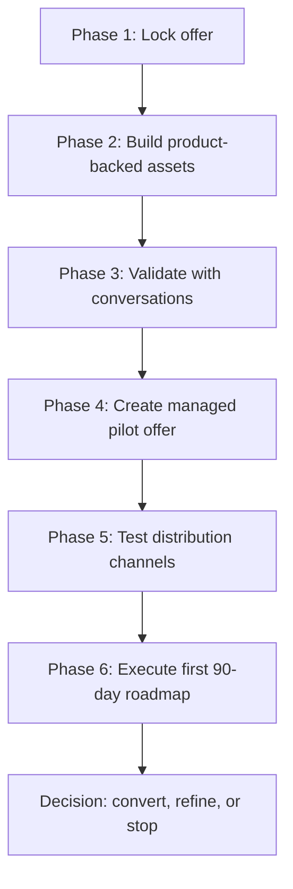

# Controlled Customer-Discovery-To-First-Customer Roadmap

Document type: internal founder operating guide.

Status: controlled internal guide. Do not use as public marketing copy, order-form language, legal terms, certification language, or security claims without the pre-publication checklist in this document.

Last verification pass: July 29, 2026.

Product posture: GCCS is a No-CUI / compliance management MVP for small U.S. government contractors. It supports readiness workflows, obligation tracking, evidence metadata, reporting artifacts, and auditability. It must not be positioned as legal advice, accounting advice, labor determinations, CMMC certification, assessor determinations, contracting-officer determinations, government approval, government endorsement, or secure CUI storage.

## Critique And Flaws

- A phase-by-phase roadmap will fail if it treats marketing copy as product truth. Product-backed claims must come from the current UI, API behavior, authorization rules, and tests.
- Customer discovery will fail if it optimizes for traffic, followers, demos, or "interesting" feedback instead of paid pilot intent.
- The first paid customer workflow can become unsafe if the roadmap allows real CUI, certification language, legal conclusions, or broad subscription promises before the product and terms support them.

## Correct Operating Model

Use the phases as a controlled pipeline:

1. Lock a narrow offer.
2. Build sales assets from current product behavior.
3. Validate the pain with 20+ direct conversations.
4. Close a managed pilot instead of a broad subscription.
5. Build distribution from manual channels before paid channels.
6. Run a 90-day execution plan to reach one paid customer and one evidence-backed niche decision.

Every phase must produce a gate decision:

| Decision | Meaning |
| --- | --- |
| Continue | Evidence supports moving forward. |
| Refine | Pain, ICP, demo, offer, or channel needs adjustment. |
| Stop | The prospect, claim, channel, or workflow conflicts with the MVP posture. |

## Verified Product-Claim Matrix

Use this table before making sales, demo, onboarding, or customer-facing claims.

| Claim area | Status | What can be said | Evidence checked |
| --- | --- | --- | --- |
| Primary app navigation | Implemented | The UI exposes `Dashboard`, `Profile`, `Contracts`, `Obligations`, `Calendar`, `Evidence`, `CMMC`, `Subcontractors`, `Reports`, and `Settings`. | `apps/web/src/App.tsx`. |
| Contract metadata workflow | Implemented | Users with contract permissions can create and manage contract metadata in the `Contracts` tab. | API routes require `ManageContracts`; UI contract flows are present in `apps/web/src/App.tsx` and `apps/api/Program.cs`. |
| Contract document upload No-CUI acknowledgement | Implemented | Contract document upload is blocked server-side until the current No-CUI acknowledgement exists. | `src/Gccs.Application/Contracts/ContractDocumentFileService.cs`; `tests/Gccs.Api.Tests/ContractRecordTests.cs`. |
| Evidence upload No-CUI acknowledgement | Implemented | Evidence upload-intent creation is blocked server-side until the current No-CUI acknowledgement exists and the caller has the correct permission. | `tests/Gccs.Api.Tests/NoCuiAcknowledgementTests.cs`; `tests/Gccs.Api.Tests/EvidenceFileUploadTests.cs`. |
| No-CUI acknowledgement UI | Implemented | The `Contracts` and `Evidence` workflows display the No-CUI acknowledgement panel; the `Evidence` upload area is disabled until acknowledgement. | `apps/web/src/App.tsx`. |
| Evidence metadata workflow | Implemented | The `Evidence` tab supports evidence metadata and linking evidence to obligations or controls. | `apps/web/src/App.tsx`. |
| Clause attachment and obligation generation | Implemented | The `Contracts` tab supports attached clauses and a `Generate obligations` action for attached clauses. | `apps/web/src/App.tsx`. |
| Reports | Implemented | The `Reports` tab supports Compliance Status, CMMC Readiness, Subcontractor Compliance, and Evidence Package workflows as report artifacts and workflow guidance. | `apps/web/src/App.tsx`. |
| Report disclaimers | Implemented in UI | The `Reports` tab states reports are workflow guidance only and not legal advice, certification decisions, assessor determinations, contracting-officer determinations, or government endorsements. | `apps/web/src/App.tsx`. |
| Audit log review | Implemented with permission boundary | The `Settings` tab exposes `Audit log` and `Tenant audit events` for users with audit-log access. | `apps/web/src/App.tsx`. |
| Landing page for customer acquisition | Planned | Treat landing page copy as planned/controlled until reviewed and published. | Existing marketing docs provide copy; no public launch evidence was verified in this pass. |
| Paid pilot order form/payment | Planned | Treat payment flow, order form, refund terms, conversion credit, testimonials, and referral terms as planned until counsel/finance review and payment tooling are implemented. | Phase 4 docs exist; no payment system or counsel-approved contract was verified in this pass. |
| Case study/testimonial | Planned | Treat case studies, testimonials, customer names, logos, and quotes as planned and permission-dependent. | No customer permission or published proof asset was verified in this pass. |
| Real CUI handling | Do not claim | Do not claim GCCS stores, processes, secures, or supports real CUI in the MVP. | Current posture is No-CUI; upload guardrails and docs prohibit real CUI. |
| CMMC certification/compliance outcome | Do not claim | Do not claim certification, compliance guarantee, assessment success, official readiness, or assessor determination. | Product and docs position reports as workflow guidance only. |

## Known Copy Risk

The current UI acknowledgement text includes a likely product-name typo: `FeDril reports` appears where customer-facing copy should say `GCCS reports`. See `apps/web/src/App.tsx`.

Do not reuse that phrase in any sales, demo, or customer-facing document. Fix the UI copy before recording public demos or onboarding real pilots.

## Pipeline Overview

## Phase 1: Lock The Offer

Primary guide: [phase-1-lock-the-offer.md](./phase-1-lock-the-offer.md)

### Objective

Define a narrow first offer that a small government contractor can understand and evaluate without enterprise procurement.

### Correct Offer

30-Day Guided Readiness Pilot.

Default pilot price: `$750`.

Allowed pilot price range: `$500-$1,500`, only when the scope and strategic value justify the change.

### Current-State Labels

| Item | Status | Notes |
| --- | --- | --- |
| No-CUI readiness workflow positioning | Implemented as product posture and documented operating boundary. | Keep language tied to current app behavior. |
| Contract metadata, clause attachment, obligations, evidence metadata, reports, and audit history | Implemented in product flows with permission boundaries. | Demonstrate only with synthetic, redacted, or non-sensitive data. |
| Paid pilot pricing | Planned business offer. | Requires counsel/finance review before real order-form use. |
| Conversion credit | Planned commercial term. | Requires written terms before customer use. |

### Step-By-Step Actions

1. Read the ICP in [phase-1-ideal-customer-profile.md](./phase-1-ideal-customer-profile.md).
2. Reject prospects that require real CUI, certification, legal advice, custom integrations, GovCloud/FedRAMP, SSO, SCIM, or enterprise procurement before pilot.
3. Use [phase-1-problem-use-cases.md](./phase-1-problem-use-cases.md) to anchor the pain around readiness spreadsheets, evidence metadata, ownership, and report artifacts.
4. Use [phase-1-positioning-messaging.md](./phase-1-positioning-messaging.md) for claims-safe wording.
5. Use [phase-1-qualification-scorecard.md](./phase-1-qualification-scorecard.md) before offering a full demo.
6. Use [phase-1-one-page-offer.md](./phase-1-one-page-offer.md) only after the prospect is qualified.
7. Use [phase-1-pilot-scope-success-plan.md](./phase-1-pilot-scope-success-plan.md) before accepting money.

### Phase 1 Gate

Move forward only when:

- ICP is specific enough to reject bad-fit prospects.
- Pain statement is buyer-recognizable.
- Pilot scope can be delivered without custom engineering.
- No-CUI boundary is explicit.
- Pricing and conversion-credit hypothesis are documented.
- No public-facing language uses danger words without evidence.

## Phase 2: Build Product-Backed Sales Assets

Primary guide: [phase-2-sales-assets-index.md](./phase-2-sales-assets-index.md)

### Objective

Create sales and demo assets that describe current app behavior accurately.

### Asset Set

| Asset | Status | File |
| --- | --- | --- |
| Sales deck | Implemented as document artifact; requires review before external use. | [gccs-phase-2-sales-deck.md](./gccs-phase-2-sales-deck.md), [gccs-phase-2-sales-deck.pptx](./gccs-phase-2-sales-deck.pptx) |
| Minimum demo structure | Implemented as guide; product claims must stay tied to exact tabs. | [minimum-demo-structure.md](./minimum-demo-structure.md) |
| Sample readiness report | Implemented as sample artifact; not a compliance determination. | [sample-readiness-report.md](./sample-readiness-report.md), [sample-readiness-report.pdf](./sample-readiness-report.pdf) |
| Sample obligation/evidence workflow | Implemented as guide; must match UI tab names. | [sample-obligation-evidence-workflow.md](./sample-obligation-evidence-workflow.md) |
| Security/data-handling page | Draft customer-facing page. | [security-and-data-handling-page.md](./security-and-data-handling-page.md) |
| No-CUI policy statement | Draft policy page. | [no-cui-policy-statement.md](./no-cui-policy-statement.md) |
| Pricing page | Draft pricing hypothesis. | [pricing-page-founder-pilot.md](./pricing-page-founder-pilot.md) |
| Terms/disclaimer language | Draft counsel review packet. | [terms-disclaimer-counsel-review.md](./terms-disclaimer-counsel-review.md) |

### Step-By-Step Actions

1. Verify every demo claim against the current UI before each external demo.
2. Use exact app tab names: `Dashboard`, `Profile`, `Contracts`, `Obligations`, `Calendar`, `Evidence`, `CMMC`, `Subcontractors`, `Reports`, `Settings`.
3. Use exact app concepts: `Attached clauses`, `Clause library search`, `Evidence metadata`, `Reports and audit packages`, `Audit log`.
4. State the No-CUI boundary before discussing uploads, evidence, reports, or contract documents.
5. Use only synthetic, redacted, or non-sensitive demo data.
6. Show report artifacts as workflow guidance, not pass/fail determinations.
7. Route terms, pricing, disclaimers, testimonial language, and public copy to counsel before real customer use.

### Phase 2 Gate

Move forward only when:

- Demo script matches visible UI.
- Any enforcement claim has API/service/test evidence.
- Sales deck and report samples avoid certification, legal, and government-endorsement claims.
- No-CUI policy is visible in the assets.
- Pricing language is labeled as a hypothesis until buyers pay.

## Phase 3: Validate With Direct Conversations

Primary guide: [phase-3-validate-with-20-conversations.md](./phase-3-validate-with-20-conversations.md)

Tracker: [phase-3-discovery-tracker.csv](./phase-3-discovery-tracker.csv)

### Objective

Validate the painful workflow before buying ads or scaling content.

### Conversation Targets

| Segment | Target completed conversations |
| --- | ---: |
| Local APEX Accelerator counselors | 3 |
| Small GovCon founders/operators | 7 |
| MSPs serving defense contractors | 3 |
| Fractional compliance consultants | 2 |
| GovCon accountants/bookkeepers | 2 |
| Proposal consultants | 2 |
| Small prime/subcontractor networks | 1 |

### Required Questions

Ask these on every discovery call:

1. Where do you track compliance tasks today?
2. What evidence do you lose track of?
3. Who asks you for proof?
4. What spreadsheet breaks first?
5. What would make this worth `$99-$499/month`?
6. What would make you refuse to use it?
7. Would you pilot this with one contract/program using only synthetic, redacted, or non-sensitive data?

### Step-By-Step Actions

1. Build a list of 80-100 prospects/advisors.
2. Segment each target before outreach.
3. Send manual outreach; do not automate early messages.
4. State that discovery calls must not include CUI, contract documents, credentials, payroll, SSNs, health data, or sensitive incident details.
5. Log each call in the tracker.
6. Score each call from 0-3.
7. Write down exact pain quotes.
8. Ask for one referral from every useful conversation.
9. Stop pursuing prospects that need real CUI or certification outcomes.
10. Move qualified prospects into Phase 4 only when pain, No-CUI fit, and paid-pilot intent are credible.

### Phase 3 Gate

Move forward only when:

- 20 conversations are logged.
- At least 10 people identify similar pain.
- At least 5 agree to demo or pilot follow-up.
- At least 2 show credible paid-pilot intent.
- At least 1 prospect is a qualified first-pilot candidate.

## Phase 4: Create And Close A Managed Pilot

Primary guide: [phase-4-create-a-pilot-offer.md](./phase-4-create-a-pilot-offer.md)

Scorecard: [phase-4-pilot-candidate-scorecard.csv](./phase-4-pilot-candidate-scorecard.csv)

### Objective

Sell a managed pilot, not a broad subscription.

### Pilot Offer

| Item | Recommended value |
| --- | --- |
| Name | 30-Day Guided Readiness Pilot |
| Default price | `$750` |
| Allowed test range | `$500-$1,500` |
| Conversion credit | Credit pilot fee toward first annual subscription if converted within the written conversion window. |
| Scope | One No-CUI readiness workflow. |
| Data | Synthetic, redacted, or non-sensitive data only. |

### First-Customer Requirements

Do not treat a prospect as the first paid pilot unless they provide:

1. Money or signed payment commitment.
2. A specific allowed workflow.
3. A named pilot owner.
4. Weekly feedback commitment.
5. Permission to use anonymized, non-identifying learnings.
6. Willingness to consider a testimonial, reference quote, or anonymized case note if successful.
7. A post-pilot buying decision date.

### Step-By-Step Actions

1. Score each candidate using the Phase 4 scorecard.
2. Reject or defer candidates below `9 / 12`.
3. Choose one workflow: contract readiness, CMMC readiness support, evidence metadata, subcontractor readiness, or synthetic modeled workflow.
4. Send pilot scope and No-CUI policy.
5. Confirm the customer will not provide prohibited data.
6. Confirm weekly feedback meetings.
7. Confirm end-of-pilot decision date.
8. Collect payment or signed pilot agreement before kickoff.
9. Personally onboard the pilot customer.
10. Track every objection.

### Phase 4 Gate

Move forward only when:

- Pilot scope is written.
- Customer owner is named.
- No-CUI posture is accepted.
- Weekly feedback is scheduled.
- Payment/order-form path is handled.
- Counsel-reviewed language is available for customer-facing contractual use.

## Phase 5: Distribution Channels

Primary guide: [phase-5-distribution-channels.md](./phase-5-distribution-channels.md)

Tracker: [phase-5-distribution-channel-tracker.csv](./phase-5-distribution-channel-tracker.csv)

### Objective

Create qualified pilot pipeline through manual, trust-building channels before paid acquisition.

### Channel Priority

1. Direct founder-led outbound to small contractors.
2. Partnerships with APEX counselors and GovCon advisors.
3. MSP/compliance consultant referral partnerships.
4. LinkedIn authority content.
5. Webinars with practical topics.
6. GovCon newsletters/podcasts.
7. Later only: paid search, directories, marketplaces.

### Step-By-Step Actions

1. Start with one niche from Phase 3 evidence.
2. Build a 100-account list.
3. Send 30-50 manual messages per week.
4. Contact 10 APEX offices or counselors for learning and educational feedback, not endorsement.
5. Test MSP/compliance consultant referral conversations.
6. Publish LinkedIn posts that support the outreach theme.
7. Run webinars only after a repeated pain pattern is clear.
8. Pitch newsletters/podcasts only when the founder story and claims-safe topic are clear.
9. Defer paid search, directories, and marketplaces until manual channels produce paid-pilot evidence.

### SAM.gov Rule

Use SAM.gov for market research: opportunities, awards, subcontract reports, agencies, NAICS patterns, set-asides, and niche selection.

Do not use SAM.gov to spam buyers, imply government endorsement, scrape indiscriminately, or copy sensitive information into GCCS.

### Phase 5 Gate

Move forward only when:

- At least 3 channels have been tested.
- Direct outbound produced at least 5 qualified conversations.
- At least 1 advisor/APEX/MSP/newsletter/webinar channel produced a qualified referral or audience opportunity.
- At least 1 channel produced a pilot proposal.
- Channel performance is recorded.
- 1-2 channels are selected for the next 90 days.

## Phase 6: First 90-Day Execution Roadmap

Primary guide: [phase-6-first-90-day-roadmap.md](./phase-6-first-90-day-roadmap.md)

Tracker: [phase-6-90-day-roadmap-tracker.csv](./phase-6-90-day-roadmap-tracker.csv)

### Objective

Convert validated discovery into one paid customer or a precise no-conversion learning.

### Days 1-14: Stabilize MVP And Sales Foundation

Actions:

1. Freeze MVP scope.
2. Fix onboarding friction.
3. Add demo seed data.
4. Create demo script.
5. Create landing page draft.
6. Create No-CUI/data-handling language.
7. Create pricing hypothesis.

Gate:

- Demo can show current product behavior with synthetic data.
- No-CUI/data-handling language is ready for review.
- Pricing is still treated as a hypothesis until paid.
- Scope is protected from unrelated feature expansion.

### Days 15-30: Create Demand And Validate Language

Actions:

1. Record demo.
2. Build prospect list of 100 small contractors/advisors.
3. Contact 10 APEX offices or counselors.
4. Run 10 discovery calls.
5. Refine ICP and language.

Gate:

- 100-prospect list exists.
- 10 discovery calls are logged or scheduled.
- Top objections are captured.
- Demo uses No-CUI posture and exact UI flow.

### Days 31-60: Convert Pilot Prospects

Actions:

1. Run 20 more calls.
2. Convert 3-5 pilot prospects.
3. Personally onboard each selected pilot.
4. Track every objection.
5. Add only features that unblock activation, reporting, evidence tracking, or trust.

Gate:

- 30 total discovery calls are logged or materially scheduled.
- 3-5 pilot prospects are scored.
- At least 1 pilot is at kickoff or pre-payment review.
- Product backlog is limited to activation, reporting, evidence tracking, and trust blockers.

### Days 61-90: Convert And Package Proof

Actions:

1. Convert one pilot to paid annual/monthly or record a precise no-conversion reason.
2. Publish one case study or anonymized workflow teardown after permission/counsel review.
3. Build partner/referral package.
4. Create repeatable onboarding checklist.
5. Choose next niche: CMMC readiness support, general GovCon compliance tracking, subcontractor readiness, or evidence management.

Gate:

- One conversion, paid extension, or precise loss reason exists.
- One proof asset exists.
- Partner/referral package exists.
- Onboarding checklist exists.
- Niche decision is documented.

## Weekly Operating Cadence

Use this every week until the first paid customer is onboarded.

| Day | Meeting | Output |
| --- | --- | --- |
| Monday | Pipeline planning | Target accounts, outreach count, demos, pilot candidates, product blockers. |
| Wednesday | Conversion review | Replies, calls, objections, next actions, at-risk opportunities. |
| Friday | Learning review | Pain patterns, message changes, product blockers, claims risks, next-week decisions. |

## Master Metrics

Track these in [controlled-customer-discovery-pipeline-tracker.csv](./controlled-customer-discovery-pipeline-tracker.csv).

| Metric | Target |
| --- | ---: |
| Prospects researched | 100+ |
| Direct outbound messages | 100+ |
| APEX/advisor contacts | 10+ |
| Discovery conversations | 30 |
| Qualified demos | 5-10 |
| Pilot prospects | 3-5 |
| Paid pilots | 1+ |
| Pilot conversion or precise no-conversion reason | 1 |
| Proof asset | 1 |
| Partner/referral package | 1 |
| Repeatable onboarding checklist | 1 |
| Niche decision | 1 |

## Pre-Publication Checklist

Use this before sending or publishing any sales, demo, compliance, onboarding, pricing, case-study, webinar, or website asset.

| Check | Question | Pass standard |
| --- | --- | --- |
| UI exposure | Does the UI expose this flow? | Exact tab/label/action is verified. |
| API enforcement | Does the API enforce this rule? | Endpoint/service evidence exists before using enforcement language. |
| Test evidence | Is there a test proving it? | Test file and scenario are identified. |
| Authorization | Is permission/RBAC behavior accurate? | Server-side permission requirement is verified. |
| Tenant/data posture | Does wording preserve No-CUI posture? | No real CUI handling claim appears. |
| Claims safety | Does wording avoid overclaims? | No certification/legal/accounting/labor/government approval claims. |
| Report language | Are reports described correctly? | Reports are workflow guidance only. |
| Counsel dependency | Does this need legal review? | Terms, pricing, testimonials, case studies, referrals, and public claims are reviewed before use. |
| Evidence/source traceability | Are obligations/content source-backed where claimed? | Source-backed claim maps to product content or sample artifact. |
| Current/future separation | Is each material claim labeled? | `Implemented`, `Partially implemented`, `Planned`, or `Do not claim`. |

## Danger Words Control

Do not use these words or phrases in public-facing claims unless the implementation and review evidence supports them:

- certified
- compliant
- approved
- guaranteed
- secure CUI storage
- legal advice
- CMMC certification
- government approved
- audit ready
- required before work begins

Allowed safer wording:

| Unsafe wording | Safer wording |
| --- | --- |
| GCCS makes you compliant. | GCCS helps organize readiness workflows and evidence metadata. |
| GCCS certifies CMMC readiness. | GCCS supports CMMC readiness workflow tracking. |
| Audit-ready reports. | Report artifacts for internal workflow review. |
| Secure CUI storage. | No-CUI compliance management MVP; real CUI is prohibited. |
| Required before work begins. | No-CUI acknowledgement is required before upload-related workflows where server-side enforcement exists. |
| Government-approved workflow. | No government endorsement claimed. |

## Feature Triage Rule During Discovery

Only build a feature during this roadmap if it unblocks at least one:

1. Activation.
2. Reporting.
3. Evidence metadata tracking.
4. Trust or No-CUI clarity.
5. Pilot conversion decision.

Everything else is deferred.

## Stop Conditions

Stop or redirect the opportunity when:

- Prospect requires real CUI handling now.
- Prospect wants certification or formal assessment outcome.
- Prospect wants legal, accounting, labor, or contracting determinations.
- Prospect will not name an owner.
- Prospect will not provide weekly feedback.
- Prospect will not accept synthetic, redacted, or non-sensitive data.
- Prospect wants custom integrations or enterprise procurement before a narrow pilot.
- Prospect only says "interesting" and will not schedule a concrete next step.

## Final Success Standard

The roadmap succeeds when one of these outcomes occurs:

| Outcome | Meaning |
| --- | --- |
| Best outcome | One paid pilot converts to annual/monthly subscription and produces permissioned proof. |
| Acceptable outcome | One paid pilot produces a precise no-conversion reason that improves ICP, product, pricing, or positioning. |
| Warning outcome | Many calls and demos occur but no one pays. Rework offer, pain statement, or target niche before more distribution. |
| Stop outcome | Repeated prospects require real CUI, certification, or services outside the MVP. Do not force the current offer. |

## Hidden Risks, Edge Cases, And Dependencies

- Product copy drift can create false claims. Re-verify UI/API/test evidence before external demos.
- The current UI has a product-name typo in the No-CUI acknowledgement panel. Fix before public demo recording.
- No-CUI posture depends on product enforcement, customer behavior, onboarding language, support handling, and incident response.
- Counsel review is a dependency for terms, pricing, public claims, testimonials, referral terms, and case studies.
- Pricing remains unproven until money changes hands.
- Advisor interest can mask lack of buyer authority. Confirm who can approve pilot payment.
- Early customers may want guided services more than software. Track founder time to avoid underpricing.
- A first paid pilot proves willingness to try, not scalable acquisition.
- SAM.gov and public directories are research tools, not permission to spam.

## Related Phase Documents

- [Phase 1: Lock The Offer](./phase-1-lock-the-offer.md)
- [Phase 2 Sales Assets Index](./phase-2-sales-assets-index.md)
- [Phase 3: Validate With 20 Conversations](./phase-3-validate-with-20-conversations.md)
- [Phase 4: Create A Pilot Offer](./phase-4-create-a-pilot-offer.md)
- [Phase 5: Distribution Channels](./phase-5-distribution-channels.md)
- [Phase 6: First 90-Day Roadmap](./phase-6-first-90-day-roadmap.md)
- [Minimum Demo Structure](./minimum-demo-structure.md)
- [No-CUI Policy Statement](./no-cui-policy-statement.md)
- [Security And Data-Handling Page](./security-and-data-handling-page.md)
- [Terms And Disclaimer Language For Counsel Review](./terms-disclaimer-counsel-review.md)
