# GCCS Workflow Diagram

This workflow shows the core operating loop for the Government Contractor Compliance SaaS MVP. It keeps the product centered on helping small government contractors determine what applies, collect proof, and stay ready for reviews while enforcing tenant-level CUI acceptance gates.

```mermaid
flowchart TD
    start(["New tenant starts GCCS"])

    profile["Create company compliance profile<br/>Legal entity, UEI, CAGE, SAM date,<br/>NAICS, size status, certifications,<br/>locations, role, FCI/CUI posture"]

    contractIntake["Add opportunity, contract, subcontract,<br/>purchase order, SOW, wage determination,<br/>or flow-down attachment"]

    uploadGuard{"Does tenant mode allow this data?"}
    noCui["Accept allowed document<br/>Synthetic/redacted CUI in demo<br/>Real CUI only in CUI-ready tenants"]
    blockCui["Block upload and show<br/>data handling guidance"]

    extract["Extract or manually tag key facts<br/>Agency or prime, contract number,<br/>period of performance, contract type,<br/>place of performance, clauses,<br/>deliverables, reports, data handling,<br/>labor needs, flow-downs"]

    obligationEngine["Map clauses and profile data<br/>to source-backed obligations"]

    reviewApplicability{"Expert review needed?"}
    expertReview["Route to advisor or internal reviewer<br/>for legal, CMMC, labor, or finance judgment"]
    publishObligations["Publish obligation dashboard<br/>Summary, owner, action, due date,<br/>evidence, risk, flow-down, source link"]

    taskCalendar["Create tasks and calendar events<br/>SAM renewal, certifications, training,<br/>SPRS/CMMC affirmation, reports,<br/>wage updates, insurance, deliverables"]

    evidenceVault["Collect evidence in vault<br/>Policies, screenshots, configs,<br/>training records, vendor attestations,<br/>signed flow-downs, audit records"]

    cmmcWorkspace["CMMC / NIST workspace<br/>Level 1 self-assessment,<br/>Level 2 readiness, SSP, POA&M,<br/>asset inventory, MSP responsibility matrix"]

    subcontractors["Subcontractor flow-down tracker<br/>Required clauses, CMMC status,<br/>insurance, NDAs, CUI access,<br/>small business status, workshare"]

    statusCheck{"Are obligations satisfied?"}
    gapWork["Assign gap remediation<br/>Request evidence, update controls,<br/>complete training, collect approvals"]

    reports["Generate reports<br/>Compliance status, obligation matrix,<br/>CMMC readiness, evidence package,<br/>subcontractor status, audit trail"]

    auditReady(["Audit, renewal, bid, prime review,<br/>or certification-ready package"])

    governance["Compliance content governance<br/>Track source URL, effective date,<br/>last reviewed date, confidence,<br/>expert approval, material changes"]

    start --> profile
    profile --> contractIntake
    contractIntake --> uploadGuard
    uploadGuard -->|"Allowed"| noCui
    uploadGuard -->|"Blocked"| blockCui
    noCui --> extract
    extract --> obligationEngine
    obligationEngine --> reviewApplicability
    reviewApplicability -->|"Yes"| expertReview
    expertReview --> publishObligations
    reviewApplicability -->|"No"| publishObligations
    publishObligations --> taskCalendar
    publishObligations --> evidenceVault
    publishObligations --> cmmcWorkspace
    publishObligations --> subcontractors
    taskCalendar --> statusCheck
    evidenceVault --> statusCheck
    cmmcWorkspace --> statusCheck
    subcontractors --> statusCheck
    statusCheck -->|"No"| gapWork
    gapWork --> taskCalendar
    gapWork --> evidenceVault
    statusCheck -->|"Yes"| reports
    reports --> auditReady
    governance -. maintains reviewed rule library .-> obligationEngine
    governance -. updates source-backed requirements .-> publishObligations
```

## Workflow Notes

- The MVP is CUI-ready by design with gated CUI acceptance. Users should be warned and blocked from uploading real CUI unless the tenant is approved as CUI-ready with a clear shared responsibility model.
- The obligation engine should rely on curated, source-backed compliance content instead of free-form AI determinations.
- Expert review is required when applicability, labor standards, CMMC scope, or legal interpretation is uncertain.
- Evidence is reusable across obligations, controls, contracts, vendors, employees, and reports.
- Governance closes the loop by keeping clause mappings, source links, effective dates, and review status current.
